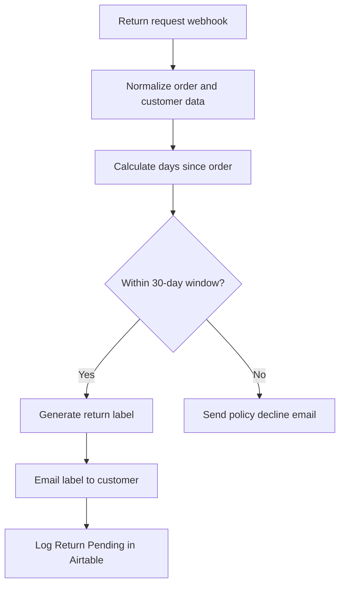

# Returns & Refunds Processor

Validates a return request against the 30-day window and auto-generates a return label for approved requests.

   


---

**[Open the visual project page →](./index.html)**

## Table of Contents

- [Overview](#overview)
- [Architecture](#architecture)
- [Workflow](#workflow)
- [Tech Stack](#tech-stack)
- [Demo status](#demo-status)
- [Setup](#setup)
- [Repository Structure](#repository-structure)
- [Disclaimer](#disclaimer)

## Overview

**Trigger:** Webhook (return request: order_id, reason, order_date, email)

Validates a return request against the 30-day window and auto-generates a return label for approved requests.

### Key Features

- Automatic return-window validation
- Return label generation
- Expected refund date tracking

## Architecture

The diagram below represents the sanitized template flow. External services, credentials, and environment-specific identifiers must be configured before execution.



## Workflow

1. Return request webhook receives the request
2. Extract order ID, reason, order date, and customer email
3. Calculate days since order and check against the 30-day window
4. Within window: generate a return label, email it, and log 'Return Pending' in Airtable
5. Outside window: send a decline email explaining the policy

## Tech Stack

- n8n
- PDF generation service
- SendGrid
- Airtable

## Demo status

A configured live-run recording is not included yet. Credentials and service identifiers remain placeholders.


## Setup

1. Import `workflow/T21_Returns_Refunds_Processor.json` into your n8n instance (**Workflows → Import from File**).
2. Replace every placeholder credential/URL in the workflow (e.g. `YOUR_..._API_KEY`, `YOUR_..._URL`) with your own service credentials.
3. Activate the workflow and point the relevant integration (webhook source, scheduled trigger, etc.) at the generated webhook URL.
4. Test with a sample payload before going live.

## Repository Structure

```text
.
├── index.html
├── README.md
├── LICENSE
├── .gitignore
└── workflow/
    └── T21_Returns_Refunds_Processor.json
```


## Disclaimer

This workflow was built as a portfolio/template project to demonstrate n8n workflow automation and AI integration. API credentials and sensitive configuration have been removed before publication — replace all `YOUR_..._KEY` / `YOUR_..._URL` placeholders with your own before use.

---

Designed and engineered by

**Oyekola Ololade**

AI Systems & Integration Engineer

- LinkedIn: <http://linkedin.com/in/ololade-oyekola-5b1797397>
- Email: <oyekolaololade69@gmail.com>
